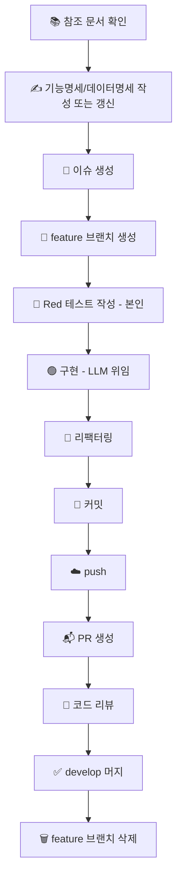

# 개발 프로세스 개요

이 문서는 Catail 프로젝트의 전체 작업 흐름을 정의한다. 각 단계의 세부 규칙은 하위 문서를 참고한다.

## 전체 흐름

## 단계별 설명

| 단계 | 설명 | 세부 문서 |
| --- | --- | --- |
| 참조 문서 확인 | 작업할 도메인의 개념정의/기능명세/데이터명세를 Notion에서 확인. 신규 도메인이면 개념정의부터 작성 | - |
| 문서 작성/갱신 | 이번에 구현할 범위를 기존 문서에 추가하거나 수정 | - |
| 이슈 생성 | 참조 문서 링크, 작업 배경, 작업 목록 작성 | [03_issue.md](./03_issue.md) |
| 브랜치 생성 | 네이밍 컨벤션에 따라 생성 | [01_branch.md](./01_branch.md) |
| Red 테스트 | 테스트 케이스 도출과 실패하는 테스트 작성은 본인이 직접 수행 | - |
| 구현 | 문서 + 테스트 스펙을 프롬프트화해 LLM에 위임, 검수 | - |
| 커밋 | 컨벤션에 따라 작성 | [02_commit.md](./02_commit.md) |
| PR 생성 | 배경/결정 사항/미정 사항/체크리스트/연관 도메인 영향/연관 이슈 작성 | [04_pr.md](./04_pr.md) |