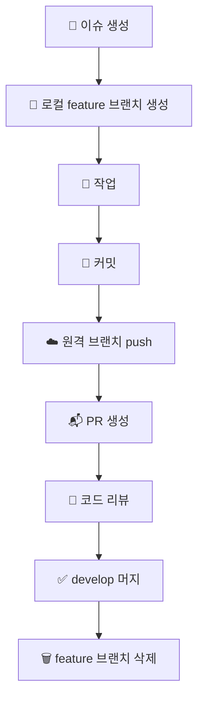

## 1. 🌱 브랜치 종류

| 브랜치 | 설명 |
| --- | --- |
| `main` | 배포 가능한 최종 코드. 직접 커밋 금지 |
| `develop` | 개발 통합 브랜치. feature 브랜치의 머지 대상 |
| `feature/*` | 이슈 단위 작업 브랜치. 작업 완료 후 삭제 |
<br>

## 2. ✏️ 브랜치 네이밍 컨벤션

```
feat/{플랫폼}-{기능명}-{이슈번호}
```

**플랫폼 prefix**

| prefix | 설명 |
|--------| --- |
| `be`   | 백엔드 |
| `fe`    | 프론트엔드 |

**예시**

```
feat/be-notice-feed-12
feat/fe-main-ui-14
```
<br>

## 3. 🔄 작업 플로우

