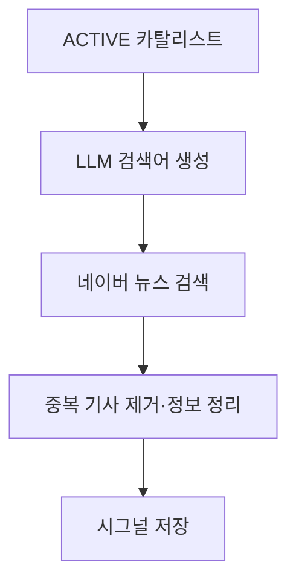

# Catail

**관심 기업의 변화를 카탈리스트로 정의하고, 관련 뉴스를 시그널로 모아 추적하는 서비스**

기업과 산업의 이슈는 하나의 기사로 끝나지 않습니다. Catail은 사용자가 추적할 주제를 **카탈리스트**로 등록하면 관련 뉴스의 수집을 돕고, 사용자가 의미 있다고 판단한 자료를 시간순으로 모아볼 수 있게 합니다.

## 핵심 개념

| 개념 | 의미 | 예시 |
| --- | --- | --- |
| 카탈리스트 | 사용자가 지속적으로 추적하려는 기업 관련 주제 | `A기업의 신사업 추진` |
| 시그널 | 카탈리스트에 연결된 개별 뉴스 자료 | 신사업 투자 발표 기사 |

## 주요 기능

### 1. 카탈리스트 생성과 모니터링

사용자는 기업, 관심 분야, 상세 설명을 입력하고 카탈리스트를 생성합니다. 모니터링 상태를 `ACTIVE`로 설정하면 생성 직후 시그널 수집이 시작됩니다. `INACTIVE`로 생성한 뒤 활성화하거나, 실행 중인 모니터링을 `PAUSED`로 일시 중지할 수도 있습니다.

### 2. 시그널 수집 파이프라인

카탈리스트가 활성화되면 저장 트랜잭션의 커밋 이후 비동기로 수집을 시작합니다. 실행 중에는 설정된 주기에 따라 활성 카탈리스트를 다시 확인합니다.

1. **검색어 생성:** 기업명, 카탈리스트 분야, 사용자가 작성한 상세 설명을 OpenAI API에 전달해 뉴스 검색어를 만듭니다.
2. **뉴스 수집:** 생성된 검색어마다 네이버 뉴스 검색 API를 호출합니다. 검색 요청은 전용 스레드 풀에서 병렬로 실행하고, 모든 요청의 완료를 기다린 뒤 결과를 합칩니다.
3. **중복 제거·정보 정리:** 검색어 간 중복 기사와 해당 카탈리스트에 이미 저장된 기사를 걸러냅니다. 기사 제목·설명에서 HTML을 제거하고 발행 시각과 언론사 정보를 정리합니다.
4. **시그널 저장:** 새 기사를 `PENDING` 시그널로 저장하고, 어떤 검색어에서 발견됐는지도 함께 기록합니다.

현재 수집 대상은 **뉴스 기사**입니다. 관련성 필터는 아직 판단 기준을 적용하지 않는 단계이므로, 수집된 모든 새 기사가 후보로 저장될 수 있습니다.

### 3. 후보 검토와 타임라인

사용자는 수집된 시그널을 확인하고 채택하거나 제외할 수 있습니다. 채택한 시그널은 카탈리스트의 타임라인에서 시간순으로 확인합니다.

> [시그널 후보·타임라인 화면 이미지 추가]

## 기술 스택

| 영역 | 사용 기술 |
| --- | --- |
| 웹 | React, TypeScript, Vite, Tailwind CSS, TanStack Query |
| 서버 | Java 21, Spring Boot, Spring Data JPA, Spring Security |
| 데이터베이스 | PostgreSQL |
| 수집·연동 | OpenAI API, 네이버 뉴스 검색 API, Jsoup, `CompletableFuture` |

## 현재 구현 범위

카탈리스트 생성·상태 변경, 활성화 이벤트 및 주기적 수집, 뉴스 시그널 저장, 후보 상태 변경, 채택 시그널 타임라인을 구현했습니다. 공시 등 다른 자료의 수집, 실제 관련성 판정, 누적 기록의 변화 요약은 현재 기능 설명에 포함하지 않았습니다.주기적으로 관리할 예정입니다.

## 프로젝트

- 개발: 이기백 (개인 프로젝트)
